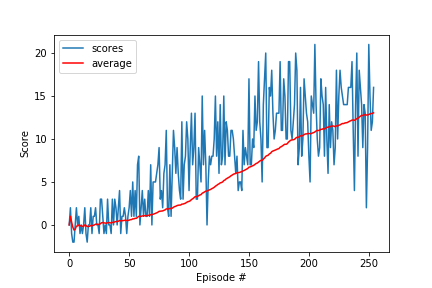

[//]: # (Image References)

[image1]: https://user-images.githubusercontent.com/10624937/42135619-d90f2f28-7d12-11e8-8823-82b970a54d7e.gif "Trained Agent"

# Deep Reinforcement Learning

In this project, we train a reinforcement learning (RL) agent that navigates an environment similar to [Unity's Banana Collector environment](https://github.com/Unity-Technologies/ml-agents/blob/master/docs/Learning-Environment-Examples.md#banana-collector). 
This is one of the projects described in the [Udacity Deep Reinforcement Learning Nanodegree repository](https://github.com/udacity/deep-reinforcement-learning/tree/master/p1_navigation).


## Environment

The environment has yellow and blue bananas scattered around a in rectangle-shaped environment. Occasionally some bananas drop from the air. The environment is episodic and runs for 300 timesteps (30 seconds).

A reward of +1 is provided for collecting a yellow banana, and a reward of -1 is provided for collecting a blue banana. The goal is to collect as many yellow bananas as possible while avoiding blue bananas. The environment is solved when the agent achieves an average score of +13 over 100 consecutive episodes.


![Trained Agent][image1]

The state space has 37 dimensions and contains the agent's velocity, along with ray-based perception of objects around agent's forward direction.  Given this information, the agent has to learn how to best select actions.  Four discrete actions are available, corresponding to:
- **`0`** - move forward.
- **`1`** - move backward.
- **`2`** - turn left.
- **`3`** - turn right.


## Instructions

1. Clone this repository, then create and activate a conda environment with
```python
conda create -n dql python=3.6
conda activate dql
```
For this project we use unity unityagents 0.4. 
You can install this and other requitements with
```python
git clone https://github.com/udacity/deep-reinforcement-learning.git
cd deep-reinforcement-learning/python
pip install .
```

2. Download the environment from one of the links below. 
Then copy the enviroment zip file in the root folder of the repository and decompress it.
You need only select the environment that matches your operating system:
    - Linux: [click here](https://s3-us-west-1.amazonaws.com/udacity-drlnd/P1/Banana/Banana_Linux.zip)
    - Mac OSX: [click here](https://s3-us-west-1.amazonaws.com/udacity-drlnd/P1/Banana/Banana.app.zip)
    - Windows (32-bit): [click here](https://s3-us-west-1.amazonaws.com/udacity-drlnd/P1/Banana/Banana_Windows_x86.zip)
    - Windows (64-bit): [click here](https://s3-us-west-1.amazonaws.com/udacity-drlnd/P1/Banana/Banana_Windows_x86_64.zip)
    
    (_For Windows users_) Check out [this link](https://support.microsoft.com/en-us/help/827218/how-to-determine-whether-a-computer-is-running-a-32-bit-version-or-64) if you need help with determining if your computer is running a 32-bit version or 64-bit version of the Windows operating system.

    (_For AWS_) If you'd like to train the agent on AWS (and have not [enabled a virtual screen](https://github.com/Unity-Technologies/ml-agents/blob/master/docs/Training-on-Amazon-Web-Service.md)), then please use [this link](https://s3-us-west-1.amazonaws.com/udacity-drlnd/P1/Banana/Banana_Linux_NoVis.zip) to obtain the environment.

3. Follow the instructions in `main.ipynb` to train the agent.

## Algorithm and Results

We use deep Q-learning with fixed Q-targets, double Q-learning and experience replay, similar to DeepMind's implementation [here](https://storage.googleapis.com/deepmind-media/dqn/DQNNaturePaper.pdf).
This algorithm solves the problem in 255 episodes.


